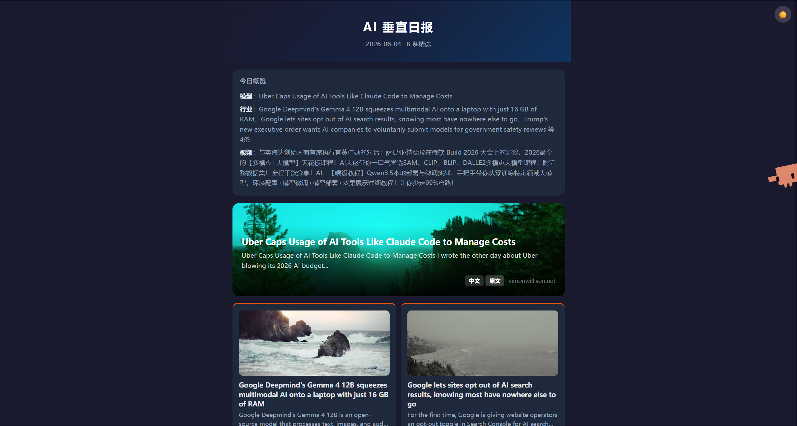
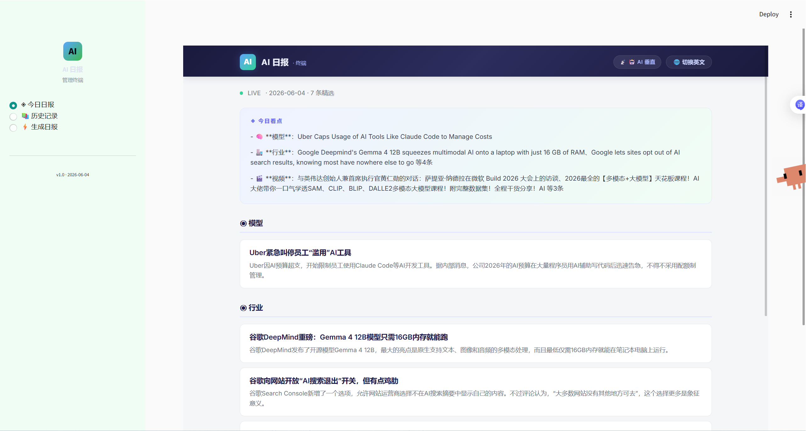

# 📡 AI 日报生成器

> 多源 RSS 资讯抓取 → AI 写文章 → HTML 阅读页 + 微信公众号草稿箱，全程自动化

[](https://vv0rfr.github.io/ai-daily/)
[](https://python.org)
[](https://github.com/vv0rfr/ai-daily/actions)

---

## ✨ 功能亮点

| 功能 | 说明 |
|------|------|
| 🤖 **AI 写文章** | DeepSeek / Claude API 自动将 RSS 资讯改写成高质量日报（比模板生成好很多） |
| 🎨 **自动配图** | 根据文章内容自动生成/选取封面图，告别干巴巴的文字 |
| 🌙 **暗色模式** | 自动跟随系统主题，手动切换，护眼又好看 |
| 📱 **响应式卡片布局** | 4 种卡片风格，桌面端 + 移动端适配 |
| 📡 **多源 RSS 抓取** | Hugging Face、Simon Willison、36氪、Hacker News、Product Hunt 等 |
| 🧹 **智能过滤** | 24h 时效过滤、AI 相关性过滤、杂糅合集去重 |
| 🌐 **GitHub Pages 部署** | 日报自动发布到 Pages，支持"阅读原文"跳转 |
| 📢 **公众号草稿箱** | 自动提交到微信公众号，支持自定义封面图 |
| 🔔 **微信推送** | Server酱 实时通知日报生成状态 |
| 🖥️ **Streamlit 管理面板** | 科幻风 Web 界面，在线查看日志、重跑任务 |

---

## 🖼️ 截图预览

<!-- TODO: 替换为真实截图 -->
<!--
  📸 截图建议（浏览器打开后截图）：
  1. https://vv0rfr.github.io/ai-daily/ —— 归档首页
  2. https://vv0rfr.github.io/ai-daily/2026-06-03-ai.html —— 日报正文（亮色/暗色）
  3. Streamlit 管理面板：运行 `streamlit run app_streamlit.py` 后截图
-->

| 归档页 | 日报正文 | 管理面板 |
|:---:|:---:|:---:|
|  |  |  |

---

## 🚀 快速开始

```bash
# 安装依赖
pip install -r requirements.txt

# 配置 API Key（推荐 DeepSeek，也可用 Claude）
cp .env.example .env
# 编辑 .env 填入 DEEPSEEK_API_KEY

# 生成 AI 日报
python main.py ai

# 生成并发布到公众号
python main.py ai --publish
```

### 运行模式

```bash
python main.py ai        # AI 垂直日报（默认）
python main.py tech      # 科技综合日报
python main.py all       # 全频道日报
```

### Streamlit 管理面板

```bash
streamlit run app_streamlit.py
# 访问 http://localhost:8501
```

---

## 🌐 在线演示

- **GitHub Pages 归档页**: [https://vv0rfr.github.io/ai-daily/](https://vv0rfr.github.io/ai-daily/)
- 每日 8:00（北京时间）自动更新，也可手动触发 Actions

---

## 🏗️ 架构

```
RSS 数据源 ──→  fetcher.py  ──→  filter.py  ──→  writer.py  ──→  publisher.py
                                              ↘  GitHub Pages
                                              ↘  Server酱 通知
```

| 模块 | 职责 |
|------|------|
| `fetcher.py` | RSS 抓取 + B站视频搜索，支持 Hugging Face、Simon Willison、36氪、HN 等 |
| `filter.py` | 去重、24h 时效过滤、分类、AI 相关性判断 |
| `writer.py` | 文章生成（DeepSeek API 优先，Claude API 备用，最后降级到模板） |
| `publisher.py` | 微信公众号 API 发布（草稿箱）、封面图上传 |
| `imager.py` | 自动配图：根据文章标签选择风格化封面 |
| `notifier.py` | Server酱 微信推送 |
| `config.py` | 数据源配置，支持 `TOP_N=5` 精简排版 |

---

## 🤖 AI 文章生成

- **DeepSeek V4**（首选）: 成本极低（~$0.02/百万 tokens），质量远超模板生成
- **Claude API**（备用）: DeepSeek 不可用时自动降级
- **模板生成**（兜底）: 无 API Key 时也能正常运行

配置 `.env`:
```
DEEPSEEK_API_KEY=sk-xxx     # 推荐
ANTHROPIC_API_KEY=sk-ant-xxx # 可选，备用
```

---

## 📦 自动化部署（GitHub Actions）

每天 UTC 00:00（北京时间 8:00）自动运行：

1. Fork 本仓库
2. 在 Settings → Secrets 添加 API Key
3. 启用 GitHub Actions

工作流包含：
- ✅ 日报生成
- ✅ GitHub Pages 部署
- ✅ Server酱 通知推送
- ⚠️ 公众号发布需本地运行（IP 白名单限制）

---

## ⚙️ 配置

### 数据源

编辑 `config.py`，支持添加自定义 RSS 源：

```python
AI_FEEDS = {
    "huggingface": "https://huggingface.co/blog/feed.xml",
    # 添加你自己的源...
}
```

### 文章数量

```python
TOP_N = 5        # 文章数量
VIDEO_TOP_N = 3  # 视频数量
```

---

## 📄 输出文件

```
output/
├── index.html              # GitHub Pages 归档首页
├── 2026-06-03-ai.html      # AI 日报阅读页
├── 2026-06-03-ai.md        # Markdown 版本
├── 2026-06-03-tech.html    # 科技日报
└── 2026-06-03-all.html     # 综合日报
```

---

## 📌 注意事项

- 个人订阅号无自动群发权限，草稿提交后需 **手动发布**
- 微信公众号 `thumb_media_id` 实际 **为必填**，不要省略
- 本地发布需要将 IP 添加到微信白名单
- JSON 序列化使用 `ensure_ascii=False`，否则中文乱码

---

## 🛠️ 技术栈

- **语言**: Python 3.11
- **API**: DeepSeek API / Claude API / Unsplash API / 微信公众平台 API
- **自动化**: GitHub Actions
- **Web 界面**: Streamlit
- **推送**: Server酱
- **数据源**: RSS / Feedparser

---

## 📁 项目结构

```
ai-daily/
├── main.py                 # CLI 入口
├── app_streamlit.py        # Web 管理面板
├── fetcher.py              # RSS 抓取
├── filter.py               # 智能过滤
├── writer.py               # AI 生成文章
├── publisher.py            # 公众号发布
├── imager.py               # 自动配图
├── notifier.py             # 微信通知
├── config.py               # 配置中心
├── scripts/
│   └── generate_index.py   # 归档页生成器
├── output/                 # 生成文件
├── .github/workflows/      # CI/CD
└── DEPLOY.md               # 部署详情
```

---

## 📜 许可

MIT License
